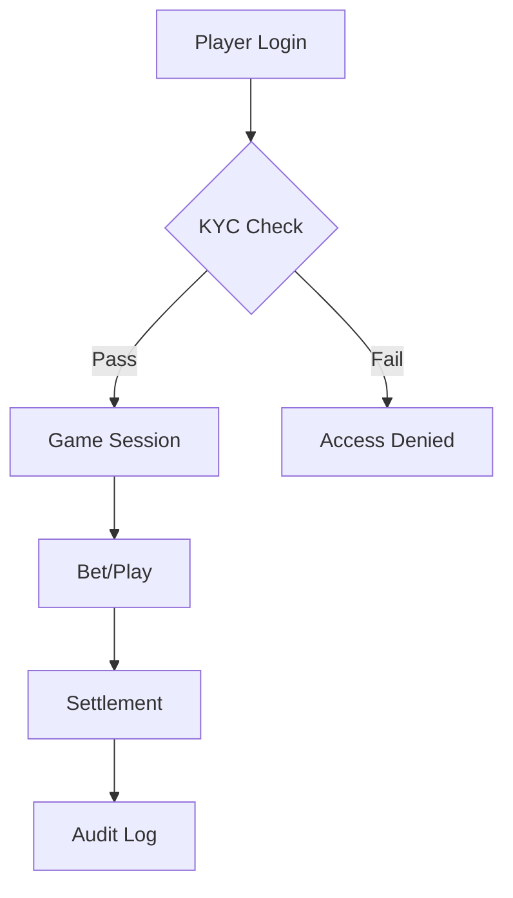

## Overview

Bee-Fee Ltd. delivers comprehensive online gaming solutions, powering casino games, sports betting, and poker experiences. You integrate these via our robust API and SDKs, enabling seamless player engagement across platforms. Key concepts include game modules, betting mechanics, real-time features, and enterprise-grade security.

<Columns cols={2}>
  <Card title="Casino Games" icon="gamepad-2" href="#">
    RNG-based slots, table games, and live dealer options.
  </Card>
  <Card title="Sports Betting" icon="trophy" href="#">
    Pre-match and live odds with risk management tools.
  </Card>
  <Card title="Poker Platform" icon="cards" href="#">
    Tournaments, cash games, and multiplayer lobbies.
  </Card>
  <Card title="Security Standards" icon="shield" href="#">
    Compliance with GDPR, MGA, and PCI-DSS.
  </Card>
</Columns>

## Casino Games Overview

Bee-Fee's casino suite offers over 1,000 titles from top providers. You access provably fair RNG games and live streams with low latency.

<Tabs>
  <Tab title="Slots" icon="slot-machine">
    Progressive jackpots and themed reels. Use our API to fetch game lists:

    <CodeGroup tabs="JavaScript,Python">
      ```javascript
      const games = await beefee.casino.listGames({ category: 'slots', limit: 20 });
      console.log(games); // [{ id: 'slot-123', rtp: 96.5 }]
      ```
      ```python
      games = beefee.casino.list_games(category='slots', limit=20)
      print(games)  # [{'id': 'slot-123', 'rtp': 96.5}]
      ```
    </CodeGroup>
  </Tab>
  <Tab title="Table Games" icon="dice-5">
    Blackjack, roulette, and baccarat variants with customizable rules.
  </Tab>
</Tabs>

## Sports Betting Mechanics

Place bets efficiently with real-time odds updates. Follow these steps to integrate betting flows:

<Steps>
  <Step title="Fetch Odds" icon="trending-up">
    Query live and pre-match odds for events.

    ```javascript
    const odds = await beefee.sports.getOdds({ sport: 'soccer', league: 'EPL' });
    ```
  </Step>
  <Step title="Place Bet" icon="shopping-cart">
    Submit player selections with stake amounts.

    ```javascript
    const bet = await beefee.sports.placeBet({
      eventId: 'match-456',
      selection: 'home-win',
      stake: 10.00
    });
    ```
  </Step>
  <Step title="Monitor Results" icon="eye">
    Track settlements and payouts automatically.
  </Step>
</Steps>

## Poker Platform Features

Bee-Fee poker supports Texas Hold'em, Omaha, and Sit & Go tournaments. You manage lobbies, anti-collusion detection, and rake distribution.

<ExpandableGroup>
  <Expandable title="Tournament Management" default-open="true">
    Schedule events with buy-ins and guarantees. Integrate leaderboards via:

    ```javascript highlight="2-4" show-lines={true}
    const tourney = await beefee.poker.createTournament({
      name: 'Daily freeroll',
      buyIn: 0,
      guarantee: 10000,
      startTime: '2024-10-20T18:00:00Z'
    });
    ```
  </Expandable>
  <Expandable title="Player Matching">
    AI-driven table balancing for optimal action.
  </Expandable>
</ExpandableGroup>

## Security and Compliance Standards

<Callout kind="alert">
  All Bee-Fee solutions enforce KYC verification and transaction monitoring to prevent fraud.
</Callout>

You maintain compliance with MGA licensing, GDPR data protection, and PCI-DSS for payments. Audit logs capture all player actions.



| Standard | Requirement | Bee-Fee Implementation |
|----------|-------------|------------------------|
| GDPR     | Data Minimization | Anonymized analytics |
| MGA      | Fair Play | Certified RNG audits |
| PCI-DSS  | Payment Security | Tokenized card processing |