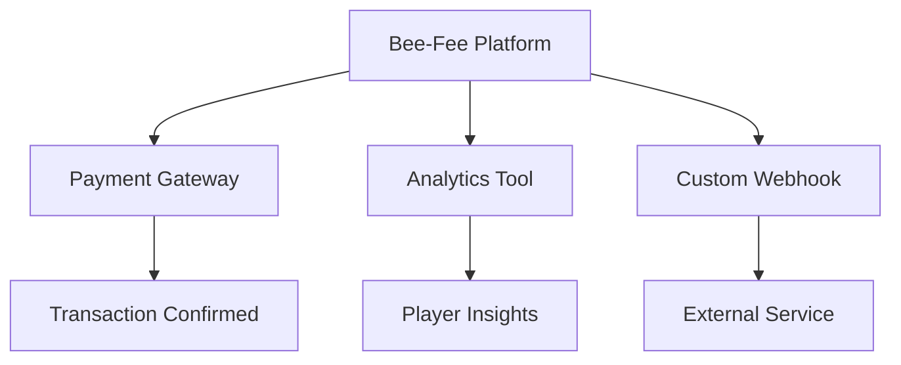

## Overview

Bee-Fee provides seamless integrations with popular third-party services to enhance your online gaming platform. You can connect payment gateways for secure transactions, analytics tools for player insights, and custom services for tailored functionality. This guide walks you through supported integrations, setup processes, and customization.

<Callout kind="info">
  Ensure your Bee-Fee account has admin privileges before starting integrations.
</Callout>

## Supported Integrations

Bee-Fee supports a wide range of services across payments, analytics, and more.

<Columns cols={3}>
  <Card title="Payment Gateways" icon="credit-card" href="/docs/payments">
    Connect Stripe, PayPal, and Skrill for global transactions.
  </Card>
  <Card title="Analytics Tools" icon="bar-chart-3" href="/docs/analytics">
    Track player behavior with Google Analytics and Mixpanel.
  </Card>
  <Card title="CRM Systems" icon="users" href="/docs/crm">
    Sync data with HubSpot and Salesforce.
  </Card>
</Columns>



## Payment Processing Setup

Set up payment processing in three steps to handle casino deposits, sports bets, and poker buy-ins securely.

<Steps>
  <Step title="Obtain API Credentials" icon="key">
    Log in to your payment provider dashboard and generate API keys.
  </Step>
  <Step title="Configure in Bee-Fee Dashboard" icon="settings">
    Navigate to Integrations > Payments and enter your credentials.
  </Step>
  <Step title="Test Transactions" icon="play">
    Use sandbox mode to simulate deposits.

    <CodeGroup tabs="cURL,JavaScript">
```bash
curl -X POST https://api.beefee.com/v1/payments/setup \
  -H "Authorization: Bearer YOUR_BEE_FEE_TOKEN" \
  -H "Content-Type: application/json" \
  -d '{
    "gateway": "stripe",
    "api_key": "pk_test_YOUR_STRIPE_KEY",
    "webhook_url": "https://your-game.com/webhooks/payments"
  }'
```
```javascript
const response = await fetch('https://api.beefee.com/v1/payments/setup', {
  method: 'POST',
  headers: {
    'Authorization': 'Bearer YOUR_BEE_FEE_TOKEN',
    'Content-Type': 'application/json',
  },
  body: JSON.stringify({
    gateway: 'stripe',
    api_key: 'pk_test_YOUR_STRIPE_KEY',
    webhook_url: 'https://your-game.com/webhooks/payments'
  })
});
```
    </CodeGroup>
  </Step>
</Steps>

<Response tabs="200,400">
```json
{
  "status": "success",
  "integration_id": "pay_1234567890",
  "message": "Payment gateway configured"
}
```

```json
{
  "status": "error",
  "code": "invalid_credentials",
  "message": "Check your API key"
}
```
</Response>

## Analytics and Reporting Connections

Connect analytics tools to monitor player engagement across casino games, sports betting, and poker tables.

<Tabs>
  <Tab title="Google Analytics" icon="google">
    Add your GA4 property ID in the Bee-Fee dashboard.

    <ParamField query="ga_property" param-type="string" required="true">
      Your GA4 measurement ID (e.g., `G-XXXXXXXXXX`).
    </ParamField>

    <ParamField header="User-Agent" param-type="string">
      Custom user agent for tracking.
    </ParamField>
  </Tab>
  <Tab title="Mixpanel" icon="activity">
    Use project token for event tracking.

    ```javascript
    mixpanel.init('YOUR_MIXPANEL_TOKEN', {
      debug: true,
      track_pageview: true,
      persistence: 'localStorage'
    });
    mixpanel.track('Player Bet Placed', {
      game_type: 'slots',
      amount: 50
    });
    ```
  </Tab>
</Tabs>

## Customization Options

<ExpandableGroup>
  <Expandable title="Advanced Webhooks" default-open="false">
    Customize webhook payloads for real-time notifications.

    <Request tabs="JavaScript,Python">
```javascript
// Listen for payment events
app.post('/webhooks/beefee', (req, res) => {
  const event = req.body;
  if (event.type === 'payment.succeeded') {
    console.log('Deposit confirmed:', event.data.amount);
  }
  res.status(200).send('OK');
});
```
```python
from flask import Flask, request

app = Flask(__name__)

@app.route('/webhooks/beefee', methods=['POST'])
def webhook():
    event = request.json
    if event['type'] == 'payment.succeeded':
        print(f"Deposit confirmed: {event['data']['amount']}")
    return 'OK', 200
```
    </Request>
  </Expandable>
  <Expandable title="Custom Parameters">
    Pass game-specific data to integrations.

    | Parameter | Type | Description |
    |-----------|------|-------------|
    | `game_id` | string | Unique game identifier |
    | `player_tier` | string | VIP, Gold, Silver |
    | `bet_amount` | number | Amount wagered |
  </Expandable>
</ExpandableGroup>

<Callout kind="tip">
  Test all integrations in staging before going live to avoid disruptions during peak betting hours.
</Callout>